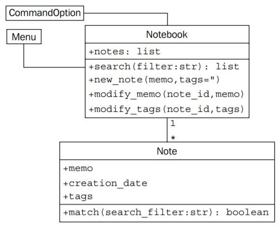
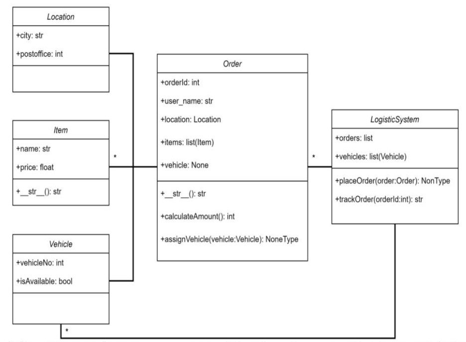

# Notebook
Explained notebook from Python 3 Object-Oriented Programming by Dusty Phillips.



### Create your Notebook

* An object is an instance of a Class.

```python
>>> myNotebook = Notebook()
```

### Add new notes

```python
>>> myNotebook.new_note("tidy up")
>>> myNotebook.new_note("buy a pencil")
>>> print(myNotebook.notes)
[<__main__.Note object at 0x0000022EDD2CE8E0>, <__main__.Note object at 0x0000022EDD2CE610>]
```

### Each note has unique id

```python
>>> print(myNotebook.notes[0].id)
1
>>> print(myNotebook.notes[1].id)
2
```

### Search for specific note, modify it

```python
>>> print(myNotebook.notes[0].memo)
tidy up
>>> myNotebook.modify_memo(1, "hello world")
>>> print(myNotebook.notes[0].memo)
hello world
```

### Run Notebook programme in terminal

```python
>>> menu = Menu()
>>> menu.run()
```


        Notebook Menu
        1. Show all Notes
        2. Search Notes
        3. Add Note
        4. Modify Note
        5. Quit
        
```python
>>> Enter an option: 3
>>> Enter a memo: order a pizza
Your note has been added.
```

        Notebook Menu
        1. Show all Notes
        2. Search Notes
        3. Add Note
        4. Modify Note
        5. Quit
        
```python
>>> Enter an option: 4
>>> Enter a note id: 1
>>> Enter a memo: order a cake
>>> Enter tags: cake
```

        Notebook Menu
        1. Show all Notes
        2. Search Notes
        3. Add Note
        4. Modify Note
        5. Quit
        
```python
>>> Enter an option: 1
order a cake
```

        Notebook Menu
        1. Show all Notes
        2. Search Notes
        3. Add Note
        4. Modify Note
        5. Quit
        
```python   
>>> Enter an option: 5
Thank you for using notebook today.
```

### Classes

* All classes have a function called __init__(), which is always executed when the class is being initiated. Use the __init__() function to assign values to object properties, or other operations that are necessary to do when the object is being created. The __init__() function is called automatically every time the class is being used to create a new object.
* The self parameter is a reference to the current instance of the class, and is used to access variables that belong to the class.

```python
    def __init__(self, memo, tags=""):
        '''initialize a note with memo and optional
         space-separated tags. Automatically set the note's
         creation date and a unique id.'''

        self.memo = memo
        self.tags = tags
        self.creation_date = datetime.date.today()
        global last_id
        last_id += 1
        self.id = last_id
```

```python
>>> isinstance(myNotebook, Notebook)
True
>>> dir(myNotebook)
['__class__', '__delattr__', '__dict__', '__dir__', '__doc__', '__eq__', '__format__', '__ge__', '__getattribute__', '__gt__', '__hash__', '__init__', '__init_subclass__', '__le__', '__lt__', '__module__', '__ne__', '__new__', '__reduce__', '__reduce_ex__', '__repr__', '__setattr__', '__sizeof__', '__str__', '__subclasshook__', '__weakref__', '_find_note', 'modify_memo', 'modify_tags', 'new_note', 'notes', 'search']
>>> Notebook.__init__
<function Notebook.__init__ at 0x00000232E199C9D0>
```

# Logistic System

System can take order to deliver to the given location.
Order consists of list of items. Each item has its price.
User can track his/her order.
Orders will be delivered by available transport.

## Classes implemented
* Item – defines the item to deliver

* Vehicle – searches available transport to deliver order

* Location – defines destination of order

* Order – contains all information abot order and its customer

* LogisticsSystem – main class, contains all information about order


